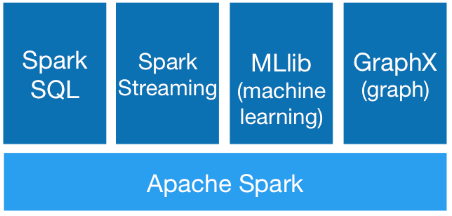
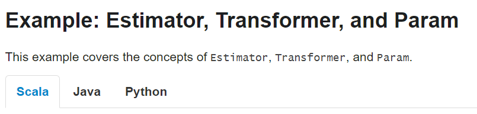
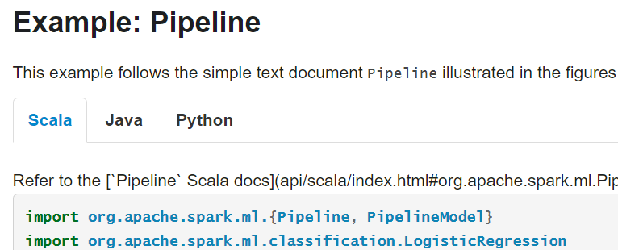

```{r, include=FALSE}
htmltools::tagList(rmarkdown::html_dependency_font_awesome())
library(knitr)
opts_chunk$set(
	comment = "",
	fig.width = 12, 
	message = FALSE,
	warning = FALSE,
	tidy.opts = list(
		keep.blank.line = TRUE,	
		width.cutoff = 150
		),
	options(width = 200),
	eval = TRUE
)
# Sys.setenv(JAVA_HOME='/usr/lib/jvm/java-7-openjdk-amd64')
```

# About me

## About me

<a href='https://whyr.pl/'></a>
<a href='https://wser.pl/'></a>
<a href='https://r-addict.com/'></a>

[whyr.pl](https://whyr.pl/) &nbsp;&nbsp;&nbsp;&nbsp;&nbsp;&nbsp;&nbsp;&nbsp;&nbsp;&nbsp;&nbsp;&nbsp;&nbsp;&nbsp;&nbsp;&nbsp;&nbsp;&nbsp;&nbsp;&nbsp;&nbsp;&nbsp;&nbsp; [wser.pl](https://wser.pl/) &nbsp;&nbsp;&nbsp;&nbsp;&nbsp;&nbsp;&nbsp;&nbsp;&nbsp;&nbsp;&nbsp;&nbsp;&nbsp;&nbsp;&nbsp;&nbsp;&nbsp;&nbsp;&nbsp;&nbsp;&nbsp;&nbsp;&nbsp;&nbsp; [r-addict.com](https://r-addict.com/)


# sparklyr = integRation

## sparklyr = integRation

- [Apache Spark](http://spark.apache.org/)
- [Spark MLlib](http://spark.apache.org/mllib/) (machine learning library)
- [R (data science) language](https://cran.r-project.org/) 
- [sparkapi](https://github.com/rstudio/sparkapi) R package
- [dplyr](https://github.com/tidyverse/dplyr) R package
- [sparklyr](http://spark.rstudio.com): dplyr back-end for Spark MLlib executed from R via sparkapi

# Apache Spark

## Spark - highlights

[spark.apache.org](http://spark.apache.org/)


> Apache Spark™ is a fast and general engine for large-scale data processing.

> Write applications quickly in Java, Scala, Python, R.

```{}
./bin/spark-shell --master local[N] # N - threads  / local, standalone
./bin/pyspark     --master mesos://host:5050  # Mesos cluster
./bin/sparkR      --master --master yarn --deploy-mode client
```

<small>
Unlike Spark [standalone](http://spark.apache.org/docs/latest/spark-standalone.html) and [Mesos](http://spark.apache.org/docs/latest/running-on-mesos.html) modes, in which the master’s address is specified in the `--master` parameter, in YARN mode the ResourceManager’s address is picked up from the Hadoop configuration. <br>
Thus, the `--master` parameter is yarn.
</small>

## Spark - Generality



<small>
Spark powers a stack of libraries including SQL and DataFrames, MLlib for machine learning, GraphX, and Spark Streaming. You can combine these libraries seamlessly in the same application.
</small>

Modules built on Spark:

- [Spark Streaming](http://spark.apache.org/docs/latest/streaming-programming-guide.html): processing real-time data streams
- [Spark SQL, Datasets, and DataFrames](http://spark.apache.org/docs/latest/sql-programming-guide.html): support for structured data and relational queries
- [MLlib](http://spark.apache.org/docs/latest/ml-guide.html): built-in machine learning library
- [GraphX](http://spark.apache.org/docs/latest/graphx-programming-guide.html): Spark’s new API for graph processing

## Spark - Runs Everywhere

> You can run Spark using its [standalone cluster mode](http://spark.apache.org/docs/latest/spark-standalone.html), on [EC2](http://spark.apache.org/docs/latest/ec2-scripts.html), on [Hadoop YARN](http://hadoop.apache.org/docs/current/hadoop-yarn/hadoop-yarn-site/index.html), or on [Apache Mesos](http://mesos.apache.org/). Access data in [HDFS](http://hadoop.apache.org/docs/stable/hadoop-project-dist/hadoop-hdfs/HdfsUserGuide.html), [Cassandra](http://cassandra.apache.org/), [HBase](http://hbase.apache.org/), [Hive](http://hive.apache.org/), [Tachyon](http://tachyon-project.org/), and any Hadoop data source.


## Spark - [Where to Go from Here?](http://spark.apache.org/docs/latest/#where-to-go-from-here)

# Spark MLlib

## Machine Learning Library (MLlib) [Guide](http://spark.apache.org/docs/latest/ml-guide.html)

<small>
MLlib is Spark’s machine learning (ML) library. Its goal is to make practical machine learning scalable and easy. At a high level, it provides tools such as:

- ML Algorithms: common learning algorithms such as classification, regression, clustering, and collaborative filtering
- Featurization: feature extraction, transformation, dimensionality reduction, and selection
- Pipelines: tools for constructing, evaluating, and tuning ML Pipelines
- Persistence: saving and load algorithms, models, and Pipelines
- Utilities: linear algebra, statistics, data handling, etc.

</small>

## MLlib can be accessed with




## Where is R?

[SparkR (R on Spark)](http://spark.apache.org/docs/latest/sparkr.html) - [Machine Learning](http://spark.apache.org/docs/latest/sparkr.html#machine-learning)

<small>
SparkR supports the following machine learning algorithms currently:

- [spark.glm](http://spark.apache.org/docs/latest/api/R/spark.glm.html) or [glm](http://spark.apache.org/docs/latest/api/R/glm.html): Generalized Linear Model
- [spark.survreg](http://spark.apache.org/docs/latest/api/R/spark.survreg.html): Accelerated Failure Time (AFT) Survival Regression Model
- [spark.naiveBayes](http://spark.apache.org/docs/latest/api/R/spark.naiveBayes.html): Naive Bayes Model
- [spark.kmeans](http://spark.apache.org/docs/latest/api/R/spark.kmeans.html): K-Means Model
- [spark.logit](http://spark.apache.org/docs/latest/api/R/spark.logit.html): Logistic Regression Model
- [spark.isoreg](http://spark.apache.org/docs/latest/api/R/spark.isoreg.html): Isotonic Regression Model
- [spark.gaussianMixture](http://spark.apache.org/docs/latest/api/R/spark.gaussianMixture.html): Gaussian Mixture Model
- [spark.lda](http://spark.apache.org/docs/latest/api/R/spark.lda.html): Latent Dirichlet Allocation (LDA) Model
- [spark.mlp](http://spark.apache.org/docs/latest/api/R/spark.mlp.html): Multilayer Perceptron Classification Model
- [spark.gbt](http://spark.apache.org/docs/latest/api/R/spark.gbt.html): Gradient Boosted Tree Model for Regression and Classification
- [spark.randomForest](http://spark.apache.org/docs/latest/api/R/spark.randomForest.html): Random Forest Model for Regression and Classification
- [spark.als](http://spark.apache.org/docs/latest/api/R/spark.als.html): Alternating Least Squares (ALS) matrix factorization Model
- [spark.kstest](http://spark.apache.org/docs/latest/api/R/spark.kstest.html): Kolmogorov-Smirnov Test


> SparkR is not sparklyr. In the time I learned sparklyr, the SparkR provided only `glm`.
</small>

# R

## R

> An open source programming language and software environment for statistical computing and graphics.

Language of Data Science

Key tool in the statistician toolbox.


- [useR ! 2017 04-07.07.2017](https://user2017.brussels/)
- [Why R? 2017 27-29.09.2017](http://whyr.pl/)

## Learn R

- [Warsaw R Enthusiast Group](https://www.meetup.com/Spotkania-Entuzjastow-R-Warsaw-R-Users-Group-Meetup/)
- [Data Crunchers / Pogromcy Danych](http://www.pogromcydanych.icm.edu.pl/) Massive Open Online Course
- [Advanced R](http://adv-r.had.co.nz/) by Hadley Wickham
- [R packages](http://r-pkgs.had.co.nz/) by Hadley Wickham
- [Extending R](https://www.crcpress.com/Extending-R/Chambers/p/book/9781498775717) by John M. Chambers
- [The Elements of Statistical Learning](https://statweb.stanford.edu/~tibs/ElemStatLearn/) by T. Hastie, R. Tibshiriani, J. Friedman

# dplyr

## [dplyr](https://cran.r-project.org/web/packages/dplyr/index.html): <br> A Grammar of Data Manipulation

- 1 R Top Package w/ [113,363 monthly distinct downloads](https://www.rdocumentation.org/)


